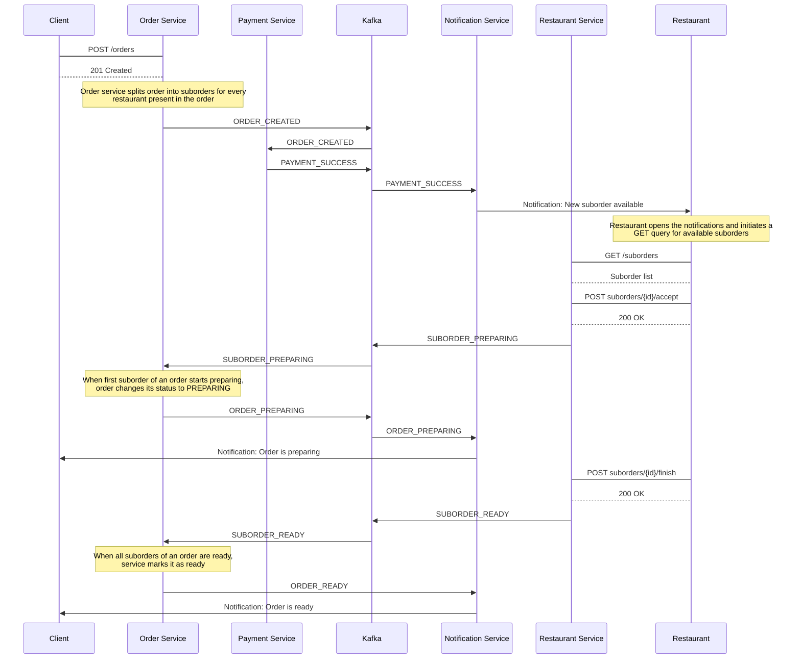

```mermaid
sequenceDiagram
  participant Client
  participant Order Service
  participant Payment Service
  participant Kafka
  participant Notification Service
  participant Restaurant Service
  participant Restaurant

  Client->Order Service: POST /orders
  Order Service-->Client: 201 Created
  note over Order Service: Order service splits order into suborders for every <br/>restaurant present in the order
  Order Service->>Kafka: ORDER_CREATED
  Kafka->>Payment Service: ORDER_CREATED
  Payment Service->>Kafka: PAYMENT_SUCCESS
  Kafka->>Notification Service: PAYMENT_SUCCESS
  Notification Service->>Restaurant: Notification: New suborder available
  note over Restaurant: Restaurant opens the notifications and initiates a <br/>GET query for available suborders
  Restaurant->Restaurant Service: GET /suborders
  Restaurant Service-->Restaurant: Suborder list
  Restaurant->Restaurant Service: POST suborders/{id}/accept
  Restaurant Service-->Restaurant: 200 OK
  Restaurant Service->>Kafka: SUBORDER_PREPARING
  Kafka->>Order Service: SUBORDER_PREPARING
  note over Order Service: When first suborder of an order starts preparing, <br/>order changes its status to PREPARING
  Order Service->>Kafka: ORDER_PREPARING
  Kafka->>Notification Service: ORDER_PREPARING
  Notification Service->>Client:Notification: Order is preparing
  Restaurant->Restaurant Service: POST suborders/{id}/finish
  Restaurant Service-->Restaurant: 200 OK
  Restaurant Service->>Kafka: SUBORDER_READY
  Kafka->>Order Service: SUBORDER_READY
  note over Order Service: When all suborders of an order are ready, <br/>service marks it as ready
  Order Service->>Notification Service: ORDER_READY
  Notification Service->>Client:Notification: Order is ready
```