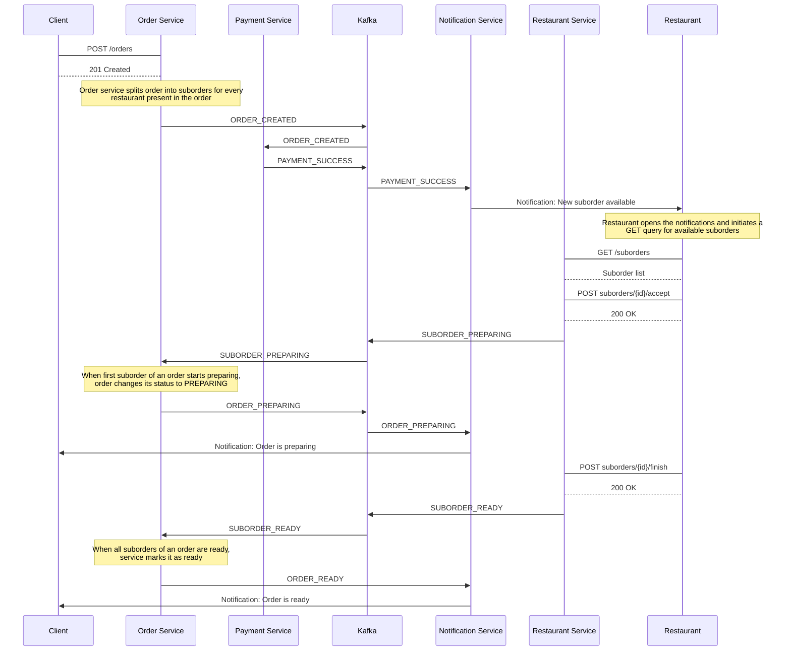

A reference implementation of a modular, event-driven microservices architecture for a FoodTech platform. Built with **Spring Boot 3.5**, **Kotlin 1.9**, and **Java 21**, this application enables customers to place orders and restaurants to manage them through the entire lifecycle — from acceptance to fulfillment.

## ❕ Disclaimer

I'm not a professional backend architect. This was a learning project for me — a playground where I tried out new things and experimented with unconventional approaches for the first time. Keep that in mind!  
Nevertheless, the project is fully functional and serves as a solid reference for modern Kotlin syntax and the latest Spring Boot features.

## 🛠️ Built With

*   **Language:** Kotlin 1.9
*   **Framework:** Spring Boot 3.5, Spring MVC, Spring Data JPA, Spring Security, Spring Cloud Gateway, Spring Cloud Netflix Eureka
*   **Java Version:** 21
*   **Database:** PostgreSQL, Redis (caching)
*   **Message Broker:** Apache Kafka
*   **Security:** Keycloak (OAuth 2.0 / JWT)
*   **Tools:** Gradle (Kotlin DSL), MapStruct, Flyway, Docker
## ✨ Features

*   **Multi-Module Gradle Setup:** The project is structured as a Gradle multi-module build with a shared common module, bundled as independent services.
*   **Service Discovery:** Netflix Eureka for dynamic service registration and discovery.
*   **API Gateway:** Spring Cloud Gateway as a single entry point for routing and cross-cutting concerns.
*   **Event-Driven Design (EDD):** Key operations handled asynchronously via Kafka.
*   **Minimalist DTO Mapping:** Custom mappers return only IDs for nested objects, minimizing response size and simplifying DTOs.
*   **Modern Security:** OAuth 2.0 and JWT authentication with Keycloak. Role-based authorization using method annotations (`@PreAuthorize`).
*   **Caching:** Redis-based caching at the service layer (DTO level).
*   **Kotlin DSL Adoption:** Leveraged Kotlin DSL for Gradle configuration and Spring Security setup.

## 📋 Architecture Notes & Decisions

- **Service Layer DTO Contracts:** The service layer exclusively consumes and returns DTOs. This design was chosen to enable straightforward and effective service-level caching strategies.
- **ID-Based Mapping for Efficiency:** Entity-to-DTO mapping is designed to "compress" nested entities into their IDs by default. This simplifies DTO structures, eliminates circular dependencies, and reduces network payload. For cases requiring full object graphs, custom repository-aware mappers are used to "decompress" these IDs on-demand.
- **Security-First API Gateway:** The API Gateway acts as a single entry point, centralizing security. It performs JWT validation and signature verification, forwarding the authenticated token to downstream services. Individual services then authorize requests by validating the token and extracting user context.

## 🧩 Project Modules

| Module                     | Purpose                                                                      |
| -------------------------- | ---------------------------------------------------------------------------- |
| **`common`**               | Shared library: common configs, beans, properties, and repositories.         |
| **`order-service`**        | Manages the order lifecycle. Primary interface for the **customer**.         |
| **`restaurant-service`**   | Manages restaurants, menus, and order status updates for **restaurants**.    |
| **`notification-service`** | Listens for events and sends email notifications.                            |
| **`payment-service`**      | Handles payment logic. _(Stub implementation, no real gateway integration)_. |

## 🚀 Getting Started

This guide assumes you have the necessary infrastructure services running independently. The application is not bundled with its dependencies via Docker Compose.

### Prerequisites

1. **Ensure the following services are installed and running on your machine:**
    - Docker
    - **PostgreSQL**
    - **Redis**
    - **Apache Kafka** (with Zookeeper or KRaft)
    - **Keycloak**
### Configuration

2. **Configure Environment Variables:**
    - Locate the `docker-compose.yml` file in the project root.
    - Override the environment variables to point to your running infrastructure services (hosts, ports).
    - Optionally, provide credentials for an SMTP server if you are going to run notification service.
### Launch

3. **Start the Application:**
    - Run the following command from the project root to build and launch all microservices and the API Gateway:
    ```bash
    docker-compose up --build
    ```
    - For the second and subsequent times you can run just `docker-compose up`, because the built jars will already be present in `build/libs` directory

**Note:** The `docker-compose.yml` file is configured only for the application modules (e.g., API Gateway, Microservices). It expects connections to your externally managed databases, cache, and other infrastructure components.
## 📚 API Endpoints

<details>
  <summary>Endpoint list</summary>

#### Orders:

- client: api/orders/create - **create order**
- all: api/orders/{id} - **get order**
- all: all: api/orders/ - **get orders by pageable**
- admin: api/orders/{id}/delete - **delete order**
- admin: api/orders/{id}/update - **update order**
- all: api/orders/{id}/status - **get order status**
- client: api/orders/{id}/cancel - **cancel order**

#### Payments:

- client: api/payments/{order_id}/pay - **pay for order**
- client: api/payments/{payment_id}/pay-by-payment-id - **pay for order by payment id**
- all: api/payments - **get payments by pageable**
- all: api/payments/{id} - **get payment**
- admin: api/payments/{id}/update - **update payment**
- all: api/payments/by-order-id/{orderId} - **get payments by order id**
- admin: api/payments/create - **create payment**
- admin: api/payments/{id}/status - **update payment status**
- admin: api/payments/{id}/delete - **delete payment**
- admin:: api/payments/{id}/cancel - **cancel payment**

#### Products:

- restaurant: api/restaurants/products/create - **create product**
- admin: api/restaurants/products/{id}/update - **update product**
- restaurant: api/restaurants/products/{id}/delete - **delete product**
- all: api/restaurants/products/{id} - **get product**
- all: api/restaurants/products - **get products by pageable**
- all: api/restaurants/products/restaurant/{restaurantId} - **get products by restaurant id**
- restaurant: api/restaurants/products/{id}/updateName - **update product name**
- restaurant: api/restaurants/products/{id}/updatePrice - **update product price**

#### Restaurants:

- restaurant: api/restaurants/create - **create restaurant**
- all: api/restaurants - **get restaurants by pageable**
- all: api/restaurants/{id} - **get restaurant**
- admin: api/restaurants/{id}/update - **update restaurant**
- restaurant: api/restaurants/{id}/delete - **delete restaurant**
- restaurant: api/restaurants/{id}/update-name - **update restaurant name**
- restaurant: api/restaurants/{id}/update-address - **update restaurant address**
- restaurant: api/restaurants/{id}/update-phone - **update restaurant phone num**
- restaurant: api/restaurants/{id}/update-email - **update restaurant email**

#### Suborders:

- admin: api/suborders/create - **create suborder**
- admin: api/suborders/{id}/update - **update suborder**
- admin: api/suborders/{id}/delete - **delete suborder**
- all: api/suborders - **get suborders by pageable**
- all: api/suborders/{id} - **get suborder**
- all: api/suborders/by-restaurant/{restaurantId} - **get suborders by restaurant and status**

---

- restaurant: api/restaurants/suborders/{id}/accept - **accept suborder**
- restaurant: api/restaurants/suborders/{id}/postpone - **postpone suborder**
- restaurant: api/restaurants/suborders/{id}/finish - **finish suborder preparation**

</details>

## **🔄** Sequence diagram

